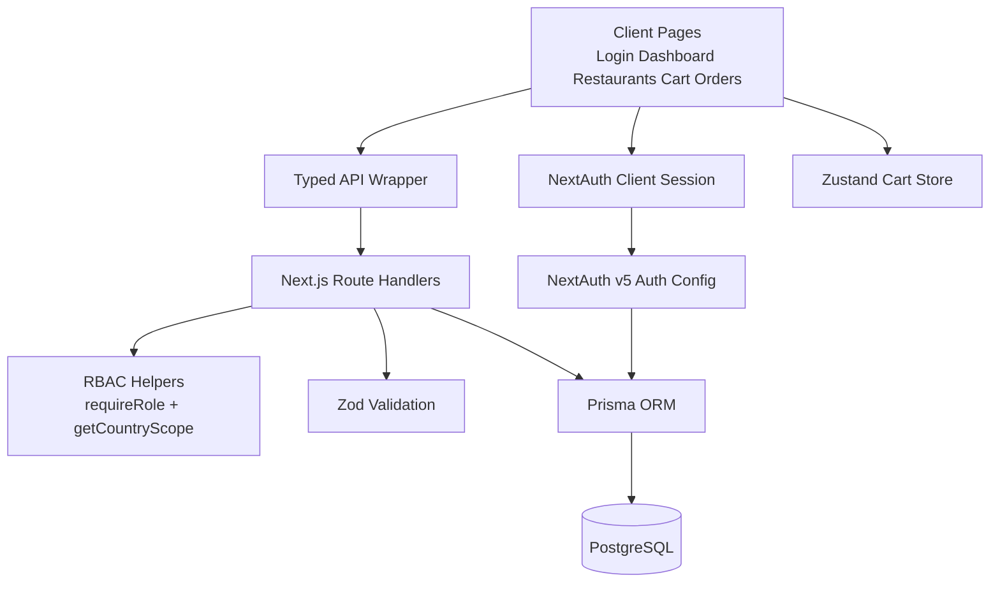

# Slooze Food Ordering App

Slooze is a full-stack Next.js App Router project for food ordering with role-based access control (RBAC) and country-scoped data access.

## Features

- Credentials login with NextAuth.js v5 (JWT sessions)
- Strict RBAC (`ADMIN`, `MANAGER`, `MEMBER`) enforced in API handlers
- Country scoping (`INDIA`, `AMERICA`) applied to database queries
- Restaurant listing and menu browsing
- Cart with per-restaurant constraint (auto-clear confirmation)
- Order creation, checkout, cancellation, and payment updates
- Zod validation for all mutation payloads
- Prisma + PostgreSQL persistence with deterministic seed data

## Tech Stack

- Next.js 14 (App Router)
- TypeScript (strict)
- Tailwind CSS
- Prisma ORM + PostgreSQL
- NextAuth.js v5 (Credentials provider)
- Zustand (cart state)
- TanStack Query (server state)
- Zod (input validation)

## Prerequisites

- Node.js 18+
- PostgreSQL
- pnpm

## Setup

```bash
git clone <your-repo-url>
cd slooze-assignment
pnpm install
cp .env.example .env
pnpm prisma migrate dev --name init
pnpm prisma db seed
pnpm dev
```

## Seeded Credentials

| Name | Role | Country | Email | Password |
| --- | --- | --- | --- | --- |
| Nick Fury | ADMIN | null | nick@slooze.com | password123 |
| Captain Marvel | MANAGER | INDIA | marvel@slooze.com | password123 |
| Captain America | MANAGER | AMERICA | america@slooze.com | password123 |
| Thanos | MEMBER | INDIA | thanos@slooze.com | password123 |
| Thor | MEMBER | INDIA | thor@slooze.com | password123 |
| Travis | MEMBER | AMERICA | travis@slooze.com | password123 |

## RBAC Permissions

| Action | ADMIN | MANAGER | MEMBER |
| --- | --- | --- | --- |
| View restaurants/menu (country-scoped) | Yes | Yes | Yes |
| Create order | Yes | Yes | Yes |
| View orders | All | Own + country | Own + country |
| Checkout order | Yes | Yes | No |
| Cancel order | Yes | Yes | No |
| Update payment method | Yes | No | No |

## API Routes

| Method | Route | Access | Description |
| --- | --- | --- | --- |
| GET | `/api/restaurants` | ADMIN, MANAGER, MEMBER | List restaurants with country scope |
| GET | `/api/restaurants/:id` | ADMIN, MANAGER, MEMBER | Get one restaurant with country guard |
| GET | `/api/restaurants/:id/menu` | ADMIN, MANAGER, MEMBER | Get menu items for a restaurant |
| GET | `/api/orders` | ADMIN, MANAGER, MEMBER | List orders by role + country scope |
| POST | `/api/orders` | ADMIN, MANAGER, MEMBER | Create order from validated items |
| GET | `/api/orders/:id` | ADMIN, MANAGER, MEMBER | Get one order with ownership checks |
| POST | `/api/orders/:id/checkout` | ADMIN, MANAGER | Confirm order |
| PATCH | `/api/orders/:id/cancel` | ADMIN, MANAGER | Cancel allowed statuses |
| PATCH | `/api/orders/:id/payment` | ADMIN | Update payment method |

## Architecture


